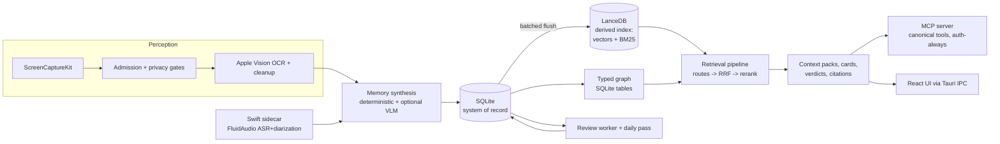

# FNDR v2 Architecture

Audience: the four builders dividing work by layer. Companions: `PRD.md` (what and why), `decisions/ADR-001..007` (the choices this document assumes), `ROADMAP-TICKETS.md` (the work breakdown). Status: proposed with the ADR set, 2026-08-19; revised 2026-08-20 with the plan-review fixes.

## 1. System overview

FNDR v2 is one desktop app with a strict internal split: a headless **Rust engine** (the product), a **Tauri shell** (windows, IPC, updater), a **React UI** (a client of the engine, with no privileged access), and a **Swift sidecar** (Apple-only ML). Agents are first-class clients over MCP; the UI and agents consume the same engine API.

## 2. Process model

| Process | Contents | Lifecycle |
|---|---|---|
| FNDR.app (Tauri) | Shell + React UI + the entire Rust engine in-process, including the MCP server on loopback (the companion server is spec-only until mobile starts) | Menu-bar resident, autostart, single instance; the instance lock also guards the database directory |
| `fndr-helper` (Swift sidecar) | FluidAudio (Parakeet ASR + pyannote diarization, Core ML/ANE), SCK system-audio tap for meetings | Spawned on demand (meeting start), supervised, JSON over stdio |
| Model worker (thread/task inside the engine) | All llama.cpp inference behind one priority queue: interactive > capture synthesis > review > backfill | Loads/unloads GGUF models with idle timers |

The engine is a library first: every crate builds and tests without Tauri (CI enforces it, ADR-001). A future daemon split (engine out of the app process) or shell swap (ADR-001 option C) is a repackaging exercise, not a redesign; nothing except the shell crate may import Tauri.

## 3. Crate workspace map

One monorepo. Owner lanes: **ML** (ML/infra), **BE** (backend), **FE** (frontend), **PL** (platform, the deferred-mobile lane).

| Crate | Responsibility | Owner | Phase |
|---|---|---|---|
| `fndr-types` | Shared domain types, ids, lifecycle enums (persisted discriminants, not strings), config structs, event payloads. specta derives feed TS generation | BE | M1 |
| `fndr-textsignal` | Ported v1 perception heuristics: OCR cleanup, line/span scoring, salience, noise estimation (ADR-005). Pure, no I/O | BE | M1 |
| `fndr-capture` | ScreenCaptureKit sampling, perceptual/semantic dedup, admission policy, session identity, the staged capture pipeline (see 4.1) | BE | M1 |
| `fndr-ocr` | Vision OCR wrapper (objc2), async at the boundary, `[LOW_CONF]` convention | BE | M1 |
| `fndr-privacy` | Blocklist (exact-token + suffix-domain), sensitive-context detection, the safety gate (Allow/Redact/SkipStorage) enforced at the storage write path | BE | M1 gate stub, M2 full |
| `fndr-store` | SQLite schema + migrations, the single Lance writer, batched flush, compaction/prune scheduler, rebuild command, deletion-everywhere | BE | M1 |
| `fndr-inference` | Model registry (pinned, checksummed, required/optional), llama.cpp session management, the model-worker priority queue, embedding contract | ML | M1 |
| `fndr-memory` | Record assembly, merge/continuity, deterministic insight derivation, VLM synthesis prompts and validators, review worker + daily pass | ML | M2 |
| `fndr-retrieval` | Routes, RRF fusion, reranker stage, relevance gates, diversity, surfacing reasons, verifier, evidence packs, context-pack budgeting | ML+BE | M2 |
| `fndr-graph` | Entity extraction (UUIDv5 identity), typed nodes/edges in SQLite, traversal queries, Louvain (real), GraphPlan | BE | M3 |
| `fndr-bench` | Eval corpus loaders, FNDR-Bench harness, baselines, resource probes; `make bench` | ML | M1 skeleton, M2 v1 |
| `fndr-mcp` | MCP server on the official Rust SDK: auth middleware, origin/host checks, rate limits, audit log, the canonical tool set (ADR-007), resources, prompts | BE | M2-M3 |
| `fndr-companion` | Companion API v2 (contract-first; spec-only until mobile starts), pairing/token registry ported from v1 with pair-start off the network | PL | M5 spec |
| `fndr-downloader` / `fndr-updater` | The only crates allowed HTTP (ADR-004 egress allowlist) | PL | M1 |
| `fndr-shell` (Tauri app) | IPC command registration, event emission, windows (main, omnibar), tray, permissions flow | PL+FE | M1 |
| `apps/helper` (Swift) | FluidAudio sidecar | PL | M4 |
| `ui/` (React + TS) | Domain-folder taxonomy from v1 (`vault`, `search`, `timeline`, `omnibar`, `workspace`, `graph`), shared token theme system, generated IPC bindings, one state store (Zustand) instead of prop drilling | FE | M1 onward |

Module size rules (the POC anti-pattern guard): no file over ~600 lines without a recorded reason; no function over ~100 lines on the hot path; every pipeline stage gets a seam (trait or function boundary) so it is testable without the loop that drives it.

## 4. Data flow

### 4.1 Write path (capture to memory)

The v1 monolith loop is replaced by a staged pipeline; each stage is a pure-ish function with its own tests, driven by a thin scheduler:

1. **Sample**: adaptive FPS from input-idle signal; forced capture interval.
2. **Gate** (pre-pixel): pause/incognito, blocklist, self-exclusion. Skips are counted per `SkipReason` (one terminal counter per tick, ported observability contract).
3. **Capture + dedup**: SCK frame; downscaled perceptual hash + A-B-A loop detection; semantic dedup window.
4. **Admission**: surface policy (navigation/listing skips, url-only records).
5. **OCR + cleanup**: Vision; `fndr-textsignal` scoring; text-volume qualification.
6. **Synthesize**: deterministic insight derivation always; VLM synthesis when loaded and pressure allows (via the model-worker queue); grounding validation; merge/continuity against recent records.
7. **Safety gate**: Allow/Redact/SkipStorage on the assembled record (last line of defense before persistence).
8. **Persist**: SQLite transaction (record + chunks + graph queue + review queue entries).
9. **Flush**: the store's Lance writer embeds (chunk-first) and indexes in batches; failures leave SQLite intact and retry.

Rules: no LLM call outside the model-worker queue; no blocking syscall on the async runtime (capture runs its own thread pool); a batch survives shutdown (durable queue, unlike v1).

### 4.2 Read path (query to context)

Query -> plan (intent, time window, filters) -> routes in two waves (vector/keyword/temporal concurrent; graph seeded by their results, only if eval-promoted) -> RRF fusion -> reranker (if promoted) -> named additive adjustments with attribution -> relevance gate -> diversity -> composition (cards, context pack, or answer) -> verifier verdict + citations. Every result carries `SurfacingReason` and `FusionSignals`. The same function serves Tauri IPC, MCP tools, and future companion routes; only composition budgets differ.

### 4.3 Review loop

Capture marks records pending; the durable queue drives the per-record review worker (model queue priority: background), with attempt caps and backoff; a daily pass consolidates the previous day. All review writes re-run grounding validation and re-embed through the same composer capture used (one embedding-text convention, fixing the v1 drift).

## 5. Storage layout

On disk under the app data dir: `fndr.sqlite3` (+WAL) as truth; `index/` for Lance tables; `models/` (registry-managed); `logs/` (JSONL quality metrics, local only; FNDR has no telemetry in the phone-home sense, see PRD non-goals).

SQLite domains (tables grouped): `memory_*` (facts, derived text, lifecycle, scores as separate tables keyed by record id), `chunks` (text + spans; vectors live only in Lance), `graph_nodes` / `graph_edges` (typed, indexed, FK-checked), `tasks`, `meetings` / `segments`, `entity_aliases`, `decision_ledger`, `review_queue`, `settings` / `devices` / `tokens`. Lance tables: `chunks_v1_qwen768` (primary search), `records_v1_qwen768` (rollup vectors), `images_v1_siglip` (P1), each with vector + FTS + scalar indexes and metadata prefilter columns. Contract naming carries the v1 convention: model and dimension in the table name; contracts move together (ADR-003/005).

## 6. Contracts between lanes

- **Engine API** (BE owns): the Rust surface `fndr-shell` and `fndr-mcp` call. Typed results, no stringly errors.
- **IPC types** (BE produces, FE consumes): generated via specta/tauri-specta; hand-mirrored TS interfaces are banned.
- **Events** (BE -> FE): push-only status channels (`capture://status`, `privacy://alerts`, model/download, review), emitted on change with fingerprint suppression; no polling for always-on state (v1 ADR-011 carried forward, completed this time).
- **MCP contract** (BE owns, ML feeds): `docs/mcp.md` v2 documents the canonical tool set (ADR-007 is the inventory of record); schema round-trip and auth-failure tests per tool.
- **Sidecar protocol** (PL owns): versioned JSON over stdio (`transcribe_segment`, `diarize`, health), supervised restart, typed unavailable states when the helper or its models are missing.
- **Bench interface** (ML owns): `make bench` runs retrieval metrics + resource probes on a corpus dir; CI compares to the committed baseline.

## 7. Phasing onto boundaries

| Phase | Boundary that must hold at the end |
|---|---|
| M1 foundations | `fndr-store` flush/rebuild proven; capture pipeline stages testable; embedding contract locked; CI gates (tests, local-only lint, no-Tauri-in-engine) green |
| M2 retrieval | Read path serves UI and first 8 MCP tools from the same function; safety gate live on the write path; FNDR-Bench v1 numbers committed with the held-out split untouched |
| M3 agent context (demo gate) | Full founding MCP surface; warm-start export and backup live; onboarding installs to connected-agent; the gate dry-run and then the PRD month-3 demo pass on a clean machine |
| M4 comprehension | Graph UI consumes `fndr-graph` directly (no intermediate schema); meetings flow through the same write path as screen capture |
| M5 assistant + proof | Omnibar/clipboard/tasks consume the engine API only; benchmark page published; companion contract signed off against the engine API |
| M6 ship | Performance budgets met and published; release pipeline notarization-ready; docs site |

The pre-agreed cut lines (PRD §10) all live outside the M1-M3 boundaries by construction.

## 8. Cross-cutting rules

- **Observability:** per-stage counters (SkipReason discipline), route latency/hit metrics, quality-event JSONL. Pipeline legibility is a P0 product feature (PRD P0.11), not an internal nicety: the health panel, capture-explain, and `fndr doctor` all read these signals, and gate outcomes are retained long enough to answer "why was this moment not captured" after the fact. None of it leaves the device.
- **Errors:** typed errors end-to-end; "unavailable" is a state with a reason, never a silent degrade (no mock fallbacks in production paths; missing models block visibly, v1 ADR-012 carried forward).
- **Config:** every tunable lives in named config structs with defaults in one module per crate; no scattered literals; capture gates are a declarative policy table with an offline replay test harness.
- **Testing:** unit tests beside pure logic; storage tests on tempdir SQLite/Lance; adversarial privacy suite; contract tests for IPC/MCP/sidecar; FNDR-Bench for quality; one clean-VM manual QA checklist per release.
- **Security defaults:** every network listener authenticates from its first commit; secrets and tokens are owner-only files; the v1 audit findings (open MCP loopback, LAN pairing mint) are the named regression tests.
